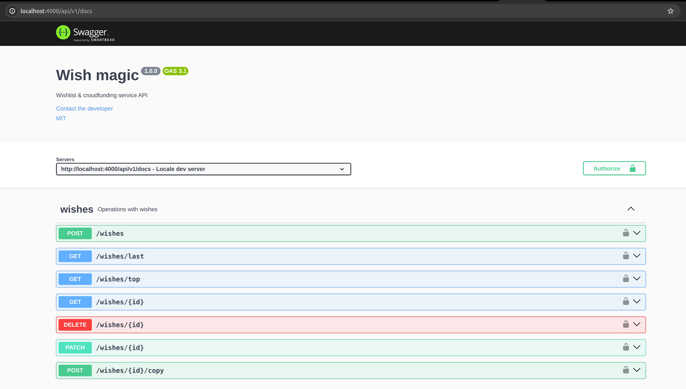

# Wish magic

<p align="center">
  <a href="#" target="blank"></a>
</p>
<p align="center" style='font-weight: bold;'>wishlist and crowdfunding service</p>

## Описание

Учебыный cрвис создания листов желаний. Каждый участник может создавать свои желания и скидываться
на желания других участников.

- Бэкенд на `Nest`
- `TypeORM` для работы с базой
- База данных `PostgreSQL`
- Фронтенд `React` разрабатывался другой командой



## Техники

:boom: Применил подход `Contract first` в работе с API (вдохновило
[видео Глеба Михеева](https://www.youtube.com/watch?v=-mzzT0b9K54)). Подход понравился тем, что
команды бэкенда, фронтенда и QA могут вести работу параллельно, потому что у них единый контракт
API.

:boom: Погрузился в спецификацию `OpenAPI`. Создал в онлайн редакторе
[swagger editor](https://editor-next.swagger.io/) файл с описанием API
[`openapi.yaml`](https://github.com/gvozdenkov/wish-magic/blob/main/backend/docs/openapi.yaml). По
нему создал REST API бэкенда и ручки фронтенда. Бэкенд на `Nest` автоматически хостит файл
спецификации по адресу http://localhost:4000/api/v1/docs. Декораторы `Nest` не очень понравились,
потому что замусоривают код. К тому же файл `openapi.yaml` можно довольно легко автоматически
локализовать на несколько языков, для интернациональных команд.

:boom: `entities` являются единым источником истины. Вся валидация происходит в `entities`. Все
`DTO` схемы только используют части `entities` для описания набора необходимых полей.

:boom: Везде использую `DTO` для описания структур передаваемых данных. Использовал подход при
котором в ответ сервера могут попасть только те поля, которые специально указаны в `DTO`. Это
дополнительная защита от того, чтобы в ответе случайно не оказались лишние поля:

```ts
// Every property is excluded by default unless you mark it as exposed
app.useGlobalInterceptors(
  new ClassSerializerInterceptor(app.get(Reflector), {
    strategy: 'excludeAll',
    excludeExtraneousValues: true,
  }),
);
```

:boom: Использую валидацию `.env` переменных с помощью схем `joi` в `ConfigModule`. Тоже
дополнительная защита от запуска приложения с неправильным набором переменных окружения.

:boom: Вынес подкючение к базе данных в отдельный модуль и настроил использование валидированных
переменных окружения.

:boom: Сервис докеризован. При запуске стартует 4 контейнера: бэкенд, база, фронтед и `adminer` для
мониторинга базы. Настроены 2 файла `docker compose`: для локальной разработки `compose.dev.yaml` и
для деплоя `compose.prod.yaml`. Версия для деплоя использует `volume` для хранения данных базы на
диске сервера. Также настроены сети для лучшей безопасности.

```ts
@Module({
  imports: [
    TypeOrmModule.forRootAsync({
      imports: [ConfigModule],
      inject: [ConfigService],
      useFactory: (configService: ConfigService) => ({
        type: 'postgres',
        host: configService.get('POSTGRES_HOST'),
        port: configService.get('POSTGRES_PORT'),
        username: configService.get('POSTGRES_USER'),
        password: configService.get('POSTGRES_PASSWORD'),
        database: configService.get('POSTGRES_DB'),
        synchronize: true,
        autoLoadEntities: true,
      }),
    }),
  ],
})
export class DatabaseModule {}
```

## Local Development with Docker

```bash
git clone git@github.com:gvozdenkov/wish-magic.git

cd wish-magic

cp backend/.env.development.example backend/.env.development

docker compose -f compose.dev.yaml up --build
# or with Makefile
make run-dev
```

## Планы по улучшению

- [ ] Выпилить `pm2` из продакшен пайплайна. Подъём упавших контейнеров переложить на `docker`

- [ ] Внедрить монорепозиторий на [`pnpm worksapce`](https://pnpm.io/workspaces) и
      [`Nx`](https://nx.dev/getting-started/intro)

- [ ] Переписать фронтенд с устаревшего `create react app` на [`remix.run`](https://remix.run/)

- [ ] Внедрить [`FSD`](https://feature-sliced.design/ru/docs) архитектуру на фронтенде для лучшей
      масштабируемости и лучшего разделения кода.

- [ ] Написать unit и e2e API тесты.

- [ ] Настроить `CI/CD` на `GitHub Actions` для автоматизации деплоя продакшн образов в хранилище
      образов `GitHub` или `DockerHub` для автоматизации деплоя на сервер.

## Контакты

- Author - Arty Gvozdenkov
- Telegram - [@gvozdenkov](https://t.me/gvozdenkov)

## License

[MIT licensed](LICENSE).
